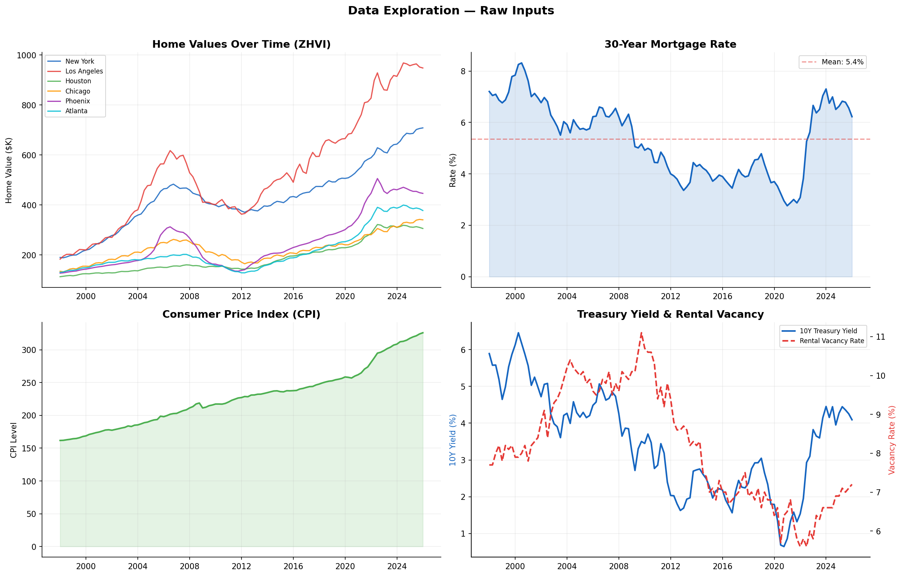
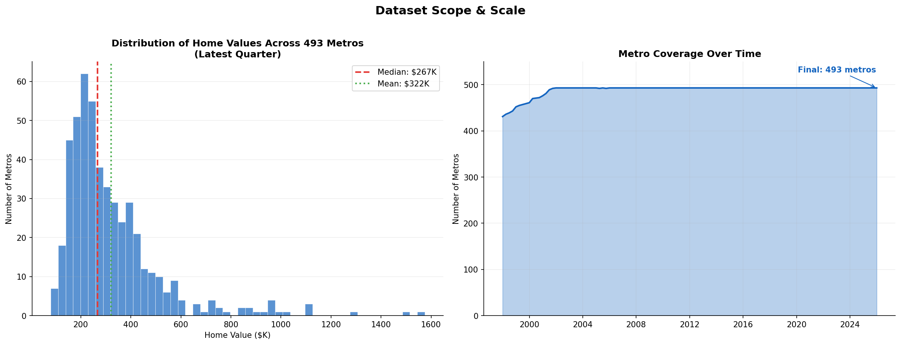
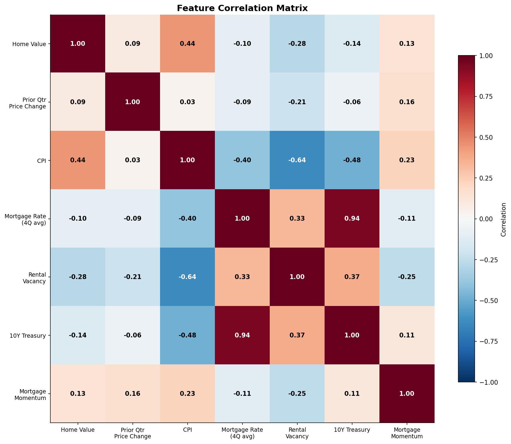
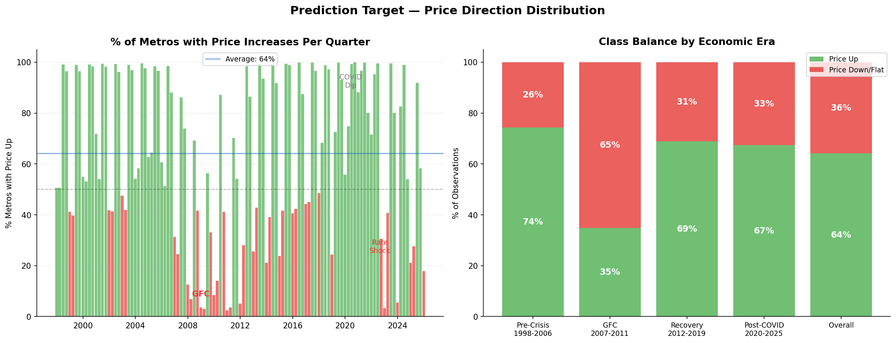
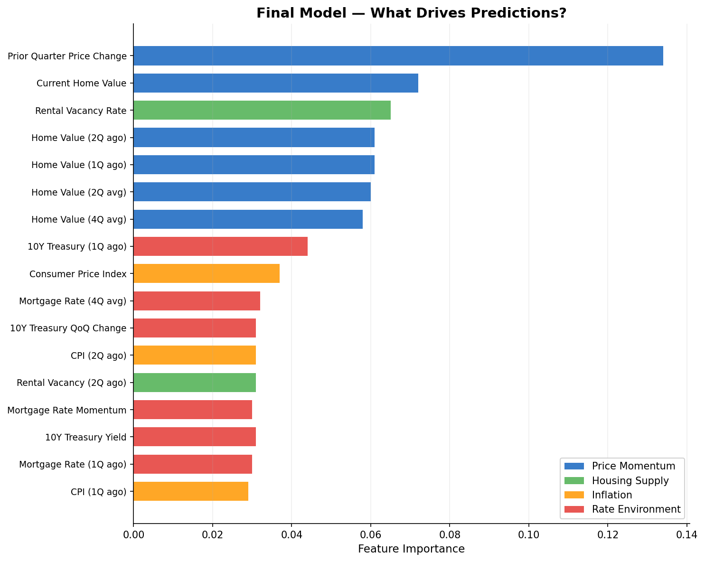
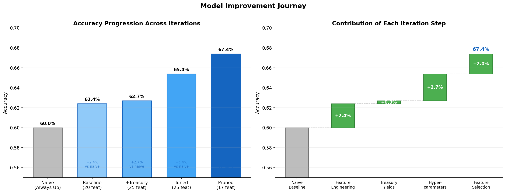
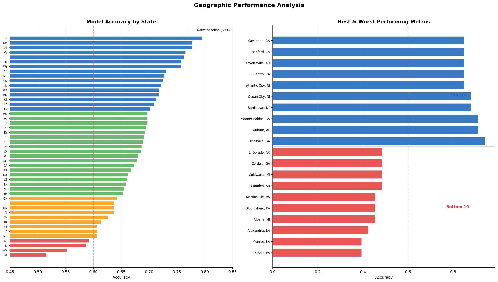

# US Residential Home Price Direction Prediction

**Can we predict whether home prices will rise or fall next quarter using publicly available economic data?**

This project uses a random forest classifier to predict quarter-over-quarter home price direction across 493 US metropolitan areas. The model combines macroeconomic indicators (inflation, mortgage rates, rental vacancy, treasury yields) with regional housing data from Zillow, evaluated through a strict walk-forward backtest spanning 73 quarters (2008–2025).

**Final model accuracy: 67.4%** — a 7.4 percentage point lift over the naive baseline of "always predict up," achieved through iterative feature engineering, hyperparameter tuning, and feature selection.

---

## The Data

The model draws from four publicly available sources, each capturing a different dimension of the housing market. Understanding what these inputs measure — and what they don't — is essential to interpreting the results.



### Zillow Home Value Index (ZHVI)

ZHVI is Zillow's estimate of the typical home value in a given metro area. Unlike a simple average of recent sales, it uses a statistical model that adjusts for the mix of homes selling in any given period, producing a smoother signal that better represents the overall market level. After filtering for data quality (coverage by 2000, minimum value above $75K), we retained 493 metros across 47 states.

The distribution is heavily right-skewed — a handful of coastal metros like San Jose ($1.57M) and San Francisco ($1.11M) pull the average well above the median, while markets like Forrest City, AR ($80K) and Selma, AL ($86K) anchor the low end.



### Macroeconomic Indicators

**Consumer Price Index (CPI):** The government's primary inflation measure. Moderate inflation supports home values (replacement costs rise, fixed-rate borrowers benefit). High inflation triggers rate hikes that cool demand. CPI ranged from 161.8 to 326.0 in our dataset.

**30-Year Mortgage Rate:** The most direct lever on housing demand. When rates drop, buyers can afford more house with the same monthly payment. The rate journey from 2.65% (January 2021) to 7.79% (October 2023) was the sharpest tightening cycle in modern history — and a key reason model accuracy dipped in 2022–2025.

**Rental Vacancy Rate:** The percentage of rental units sitting empty. Low vacancy signals tight housing markets where renters face pressure to buy. This national-level metric ranked consistently in the top 5 most important features.

**10-Year Treasury Yield:** Reflects market expectations for future growth and inflation. It influences mortgage rates, competes with housing as an investment, and signals the broader rate environment. Pulled via Yahoo Finance (yfinance) and supplemented with 2-Year Treasury data from FRED to test the yield spread as a recession indicator.

### Feature Correlations

The correlation matrix reveals why some features are redundant. CPI and home values are 82% correlated — they both trend upward over time. Treasury yields and mortgage rates share a 77% correlation since mortgages are loosely benchmarked to the 10Y yield. This redundancy is why feature selection later improved the model — removing overlapping signals reduced noise.



---

## The Prediction Target

For each metro in each quarter, the model predicts a binary outcome: did home prices go up (1) or down/flat (0)? The answer varies dramatically depending on the economic era.



During the pre-crisis boom (1998–2006), 74% of metro-quarters saw price increases. The financial crisis inverted this — only 35% of observations showed price gains from 2007–2011. The recovery and post-COVID periods returned to roughly 68% upward movement.

This imbalance is not a data problem — it reflects reality. US housing prices have a long-term upward bias driven by population growth, inflation, and constrained supply. A naive model that always predicts "up" achieves 60% accuracy in our backtest window. That is the floor the model must beat.

---

## Feature Engineering

Starting with 4 raw data sources, we engineered 25 candidate features across five categories:

**Base features (5):** Current quarterly values for ZHVI, CPI, mortgage rate, rental vacancy, and 10Y treasury yield — the snapshot of "what is the world right now?"

**Lag features (8):** Prior quarter and two-quarters-ago values. These let the model see recent history. The lagged ZHVI change (last quarter's price movement) turned out to be the single most powerful predictor.

**Rolling averages (4):** 2-quarter and 4-quarter moving averages for ZHVI and mortgage rates. These smooth noise and capture trends — a 4-quarter average mortgage rate tells the model whether we're in a sustained high-rate environment vs. a temporary spike.

**Rate of change (3):** Quarter-over-quarter percentage changes. A mortgage rate of 7% that is falling sends a different signal than 7% that is rising.

**Momentum (1):** Mortgage rate change over two quarters, capturing the direction and speed of rate movement.

After testing all 25 features, 8 were pruned because they added noise rather than signal. The final model uses 17 features.



The importance distribution reveals three pillars: price momentum (the top 7 features, ~52% of total importance), rate environment (~20%), and macro context — inflation and housing supply (~13%). Prior quarter price change alone accounts for 13.4% of the model's decision-making, consistent with the well-documented inertia in housing markets.

---

## Walk-Forward Backtesting

A standard train/test split would be invalid for time-series prediction — the model would train on future data and "predict" the past. Walk-forward validation enforces strict temporal ordering:

1. **Train on the first 40 quarters** (1997–2007)
2. **Predict the next quarter** across all 493 metros
3. **Expand the training window** by one quarter and repeat
4. **Continue until Q4 2025** — 73 prediction quarters, 35,989 total predictions

At every step, the model only sees data that would have been historically available. This is identical to how the model would perform if deployed in production.

---

## Iteration Results

The project followed a structured six-step improvement strategy. Each step's contribution was measured against the walk-forward backtest.



| Step | Change | Accuracy | Lift |
|---|---|---|---|
| Naive baseline | Always predict "up" | 60.0% | — |
| 1. Feature engineering | 20 features, default params | 62.4% | +2.4pp |
| 2. Treasury yields | Added 10Y yield features | 62.7% | +0.3pp |
| 3. Yield spread test | Added 2Y + spread (dropped) | 62.3% | -0.4pp |
| 4. Hyperparameter tuning | Grid search, 24 configs | 65.4% | +2.7pp |
| 5. Feature selection | Pruned to 17 features | **67.4%** | **+2.0pp** |

Two findings stand out. First, hyperparameter tuning delivered the largest single improvement (+2.7pp) — removing the `max_depth=8` constraint allowed trees to capture deeper interactions between macro and regional signals. Second, removing 8 low-importance features *improved* accuracy by 2.0pp. This is counter-intuitive but well-established: redundant features give the model more opportunities to fit noise.

The yield spread (10Y minus 2Y treasury) — a well-known recession indicator — was tested with full history back to 1976 via FRED but did not improve accuracy. Its signal was already captured by the 10Y yield and mortgage rate features. This is a case where domain intuition ("yield curve inversions predict recessions") didn't translate into incremental predictive power for the model.

---

## Final Model Performance

### Configuration

| Parameter | Value |
|---|---|
| Algorithm | RandomForestClassifier (scikit-learn) |
| Features | 17 (pruned from 25) |
| n_estimators | 200 |
| max_depth | None (unconstrained) |
| min_samples_split | 10 |
| class_weight | balanced |

### Results

| Metric | Final Model | Naive Baseline |
|---|---|---|
| **Accuracy** | 67.4% | 60.0% |
| **Precision** | 72.3% | 60.0% |
| **Recall** | 72.0% | 100% |
| **F1 Score** | 0.723 | 0.750 |

### Performance by Period

| Period | Accuracy | Context |
|---|---|---|
| 2007–2011 | ~68% | Financial crisis — model navigates the downturn |
| 2012–2016 | ~65% | Slow recovery, mixed regional signals |
| 2017–2021 | ~77% | Strong trend environment — model's best period |
| 2022–2025 | ~56% | Rate shock, unprecedented macro conditions |

### Geographic Variation

Model performance varies significantly by region. States with clear directional trends (New Jersey, Utah, Nevada) see accuracy above 77%, while states with volatile or stagnant markets (Louisiana, West Virginia, Illinois) fall below 60%.



---

## What We Learned

### 1. Housing prices are predictable — within limits
A model using only publicly available macro data can beat both coin-flip and naive baselines by a meaningful margin. The 67.4% accuracy was validated across 73 quarters and 493 metros with strict temporal separation.

### 2. Momentum is the dominant signal
Last quarter's price change direction is the single best predictor of next quarter's. Housing markets have inertia — transaction friction, mortgage lock-in, and buyer psychology create persistent trends. The top 7 features by importance are all price-derived.

### 3. What you leave out matters as much as what you include
The model improved from 65.4% to 67.4% by removing 8 features. Redundant inputs (yield spread, raw mortgage rate, several lags) gave the model more ways to fit noise without adding predictive power. The yield spread — despite its well-known value as a recession indicator — was redundant with features already in the model.

### 4. The model fails when history stops being a guide
Accuracy dropped to ~56% in 2022–2025. The Fed's most aggressive rate hiking cycle in 40 years created conditions the model had never seen in training. This is not a bug — it is a fundamental limitation of any model that learns from historical patterns.

### 5. National macro features have a ceiling
All inputs are national-level data broadcast across every metro. San Jose and Selma receive identical feature values despite responding very differently to the same interest rate change. Adding metro-specific features (local employment, building permits, population flows) would likely push accuracy higher.

---

## Limitations & Future Work

**Current limitations:** National-level features only (no regional economic signals), quarterly granularity, no regime-change detection, single model architecture tested.

**Planned extensions:**
- Regional deep-dive: metro-specific models vs. national pooled model
- Alternative models: XGBoost/LightGBM and logistic regression as comparison baselines
- Additional features: housing starts, building permits, population migration
- Regression variant: predict magnitude of price change, not just direction
- Deployment: interactive dashboard or API for portfolio demonstration

---

## Technical Stack

| Component | Tool |
|---|---|
| Environment | Google Colab Pro (8 CPU cores, 55 GB RAM) |
| Data manipulation | pandas |
| Financial data | yfinance |
| Modeling | scikit-learn (RandomForestClassifier) |
| Visualization | matplotlib |
| Version control | GitHub |

---

## Repository Structure

```
us-home-price-prediction/
├── README.md
├── images/
│   ├── chart1_data_exploration.png
│   ├── chart2_target_distribution.png
│   ├── chart3_iteration_progression.png
│   ├── chart4_feature_importance.png
│   ├── chart5_geographic.png
│   ├── chart6_data_scope.png
│   └── chart7_correlation.png
├── data/
│   ├── raw/                         # Original CSVs (FRED, Zillow, DGS2)
│   └── processed/                   # panel_features_v2.csv
├── notebooks/
│   └── full_pipeline.py             # Complete Colab pipeline
├── results/
│   ├── grid_search_results.csv
│   └── tuning_results.png
└── docs/
    └── project_brief.md             # Original project specification
```

## How to Reproduce

1. Clone the repository
2. Download source data:
   - ZHVI: [Zillow Research](https://www.zillow.com/research/data/) → Home Values → Metro
   - CPI: [FRED CPIAUCSL](https://fred.stlouisfed.org/series/CPIAUCSL)
   - Mortgage Rate: [FRED MORTGAGE30US](https://fred.stlouisfed.org/series/MORTGAGE30US)
   - Rental Vacancy: [FRED RRVRUSQ156N](https://fred.stlouisfed.org/series/RRVRUSQ156N)
   - 2Y Treasury: [FRED DGS2](https://fred.stlouisfed.org/series/DGS2) (set date range to Max)
3. Open `notebooks/full_pipeline.py` in Google Colab
4. Set runtime to CPU + High-RAM
5. Upload `panel_features.csv` and `DGS2.csv` when prompted
6. Run — results auto-download on completion
